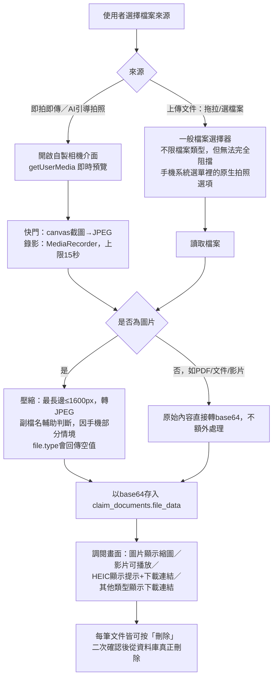
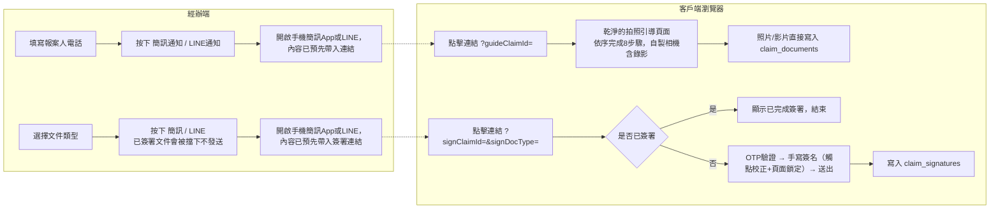
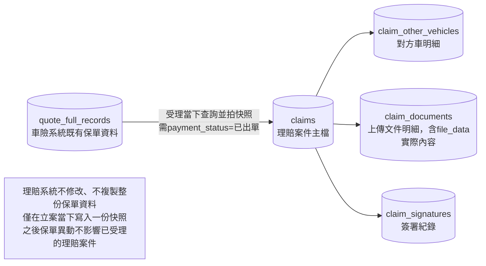

# 汽車險理賠系統（事故報案處理）— 流程圖

版本：v2.0（涵蓋樂觀鎖、真實檔案儲存、自製相機、遠端簽署等後續迭代）

## 一、主流程（經辦人員操作）

```mermaid
flowchart TD
    A[輸入車號] --> B[按下「受理與查詢報案」]
    B --> C[查詢 quote_full_records 找該車最新一筆<br/>payment_status=已出單 的紀錄]
    C -->|查無投保紀錄| D[🔴 紅燈：拒絕受理]
    C -->|有紀錄| E{在有效保期內<br/>且已出單？}
    E -->|否| F[🔴 紅燈：拒絕受理<br/>不帶出任何投保內容]
    E -->|是| G[🟢 綠燈：受理成功]
    G --> H{此車號是否已有<br/>未結案且未註銷的案件}
    H -->|有| I[帶出既有案件完整進度<br/>不重新產生新編號、不彈提示]
    H -->|沒有| J[立即寫入 claims 產生立案編號<br/>資料庫唯一索引防同車號重複受理<br/>撞號自動重試下一號]
    J -->|寫入時仍被搶先| K[改為帶出對方剛建立的那筆<br/>並提示已被受理]
    I --> L[被保險人資料：唯讀快照，不可修改]
    J --> L
    K --> L
    L --> M[駕駛人：可填寫，或按「同被保險人」帶入]
    M --> N[對方車及事故狀況：可新增／暫時隱藏／永久刪除<br/>警報／警方單位為案件層級，不分對方車]
    N --> O[事故處理：上傳文件／即拍即傳／<br/>AI引導拍照(8步驟，含錄影)／AI文件辨識*]
    O --> P[案件分流：規則判斷，可人工覆蓋]
    P --> Q[修車估價：上傳文件／即拍即傳／應備文件清單]
    Q --> R[文件線上簽署：已簽署文件直接擋下重簽<br/>OTP＋簽名，簽署期間鎖定頁面不可捲動]
    R --> S[按「儲存立案資料」]
    S --> T{樂觀鎖檢查：<br/>資料庫版本與畫面讀取時是否一致}
    T -->|不一致，已被他人存過| U[擋下儲存，提示重新查詢取得最新版本]
    T -->|一致| V[寫入成功，畫面清空<br/>要繼續處理需重新查詢該車號帶回進度]
    V --> W{是否已填妥決算金額}
    W -->|是，按結案並確認Y| X[結案：清空畫面，該車號釋出]
    W -->|否| B

    style D fill:#f8d7da
    style F fill:#f8d7da
    style G fill:#d4edda
    style X fill:#d4edda
    style U fill:#fff3cd
```

\* AI文件辨識目前為介面預留功能，尚未串接真實影像辨識服務。

---

## 二、文件上傳與檔案儲存流程（v2.0 新增重點）



---

## 三、客戶自助分流（簡訊／LINE 連結）



---

## 四、資料來源關係圖



