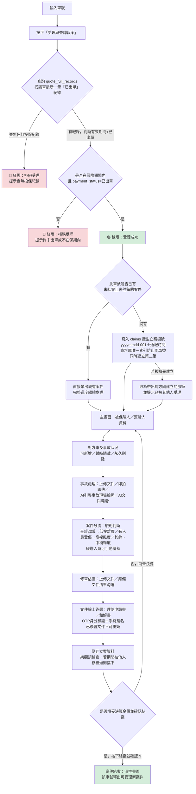
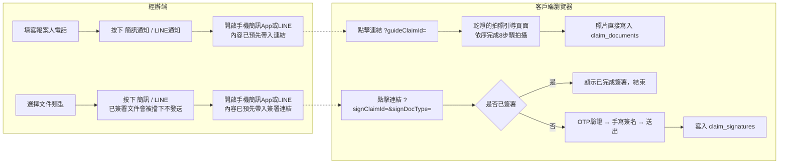
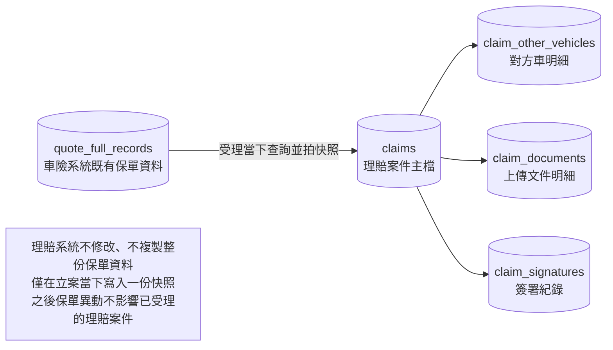

# 汽車險理賠系統（事故報案處理）— 流程圖

## 一、主流程（經辦人員操作）

```mermaid
flowchart TD
    A[輸入車號] --> B[按下「受理與查詢報案」]
    B --> C{查詢 quote_full_records<br/>找該車最新一筆「已出單」紀錄}
    C -->|查無任何投保紀錄| D[🔴 紅燈：拒絕受理<br/>提示查無投保紀錄]
    C -->|有紀錄，判斷有效期間+已出單| E{是否在保險期間內<br/>且 payment_status=已出單}
    E -->|否| F[🔴 紅燈：拒絕受理<br/>提示尚未出單或不在保期內]
    E -->|是| G[🟢 綠燈：受理成功]
    G --> H{此車號是否已有<br/>未結案且未註銷的案件}
    H -->|有| I[直接帶出既有案件<br/>完整進度繼續處理]
    H -->|沒有| J[寫入 claims 產生立案編號<br/>yyyymmdd-001＋通報時間<br/>資料庫唯一索引防止同車號同時建立第二筆]
    J -->|若被搶先建立| K[改為帶出對方剛建立的那筆<br/>並提示已被其他人受理]
    I --> L[主畫面：被保險人／駕駛人資料]
    J --> L
    K --> L
    L --> M[對方車及事故狀況<br/>可新增／暫時隱藏／永久刪除]
    M --> N[事故處理：上傳文件／即拍即傳／<br/>AI引導事故現場拍照／AI文件辨識*]
    N --> O[案件分流：規則判斷<br/>金額≤3萬→低複雜度／有人員受傷→高複雜度／其餘→中複雜度<br/>經辦人員可手動覆蓋]
    O --> P[修車估價：上傳文件／應備文件清單勾選]
    P --> Q[文件線上簽署：理賠申請書／和解書<br/>OTP身分驗證＋手寫簽名<br/>已簽署文件不可重簽]
    Q --> R[儲存立案資料<br/>樂觀鎖檢查：若期間被他人存檔過則擋下]
    R --> S{是否填妥決算金額並確認結案}
    S -->|否，尚未決算| L
    S -->|是，按下結案並確認 Y| T[案件結案：清空畫面<br/>該車號釋出可受理新案件]

    style D fill:#f8d7da
    style F fill:#f8d7da
    style G fill:#d4edda
    style T fill:#d4edda
```

\* AI文件辨識目前為介面預留功能，尚未串接真實影像辨識服務。

---

## 二、客戶自助分流（簡訊／LINE 連結）

經辦人員在主畫面可以把兩種作業，透過簡訊或LINE直接發連結給客戶自行完成，不需要客戶登入或看到內部系統畫面。

```mermaid
flowchart LR
    subgraph 經辦端
        A1[填寫報案人電話] --> A2[按下 簡訊通知 / LINE通知]
        A2 --> A3[開啟手機簡訊App或LINE<br/>內容已預先帶入連結]
        B1[選擇文件類型] --> B2[按下 簡訊 / LINE<br/>已簽署文件會被擋下不發送]
        B2 --> B3[開啟手機簡訊App或LINE<br/>內容已預先帶入簽署連結]
    end

    subgraph 客戶端瀏覽器
        C1[點擊連結 ?guideClaimId=]--> C2[乾淨的拍照引導頁面<br/>依序完成8步驟拍攝]
        C2 --> C3[照片直接寫入 claim_documents]
        D1[點擊連結 ?signClaimId=&signDocType=] --> D2{是否已簽署}
        D2 -->|是| D3[顯示已完成簽署，結束]
        D2 -->|否| D4[OTP驗證 → 手寫簽名 → 送出]
        D4 --> D5[寫入 claim_signatures]
    end

    A3 -.-> C1
    B3 -.-> D1
```

---

## 三、資料來源關係圖

```mermaid
flowchart LR
    QR[(quote_full_records<br/>車險系統既有保單資料)] -->|受理當下查詢並拍快照| CL[(claims<br/>理賠案件主檔)]
    CL --> OV[(claim_other_vehicles<br/>對方車明細)]
    CL --> DOC[(claim_documents<br/>上傳文件明細)]
    CL --> SIG[(claim_signatures<br/>簽署紀錄)]

    note1[理賠系統不修改、不複製整份保單資料<br/>僅在立案當下寫入一份快照<br/>之後保單異動不影響已受理的理賠案件]
```
